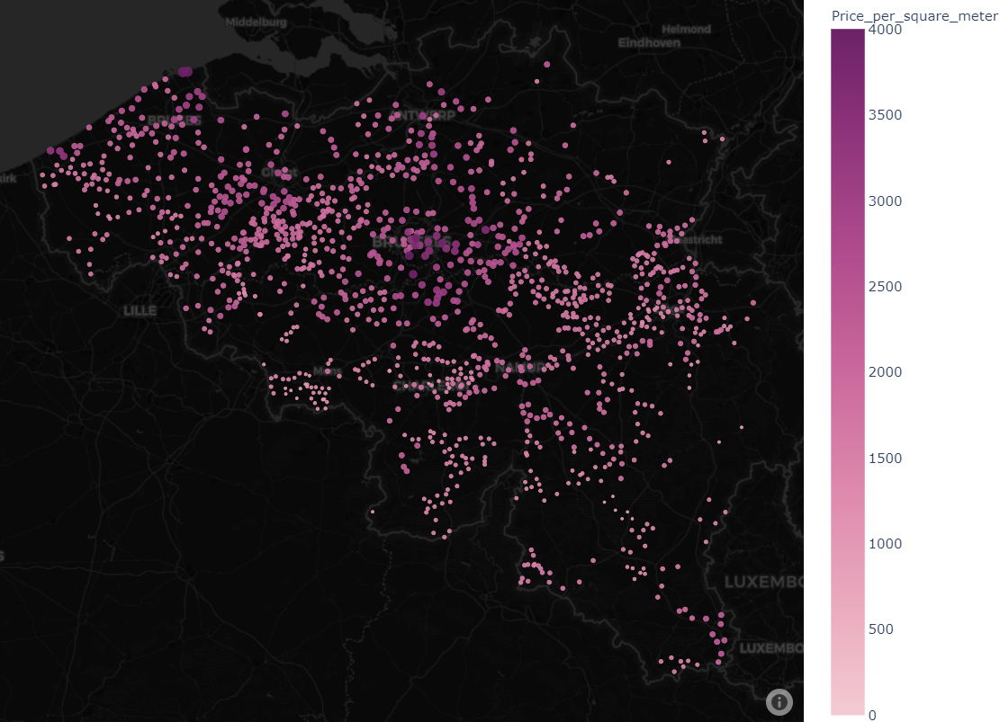
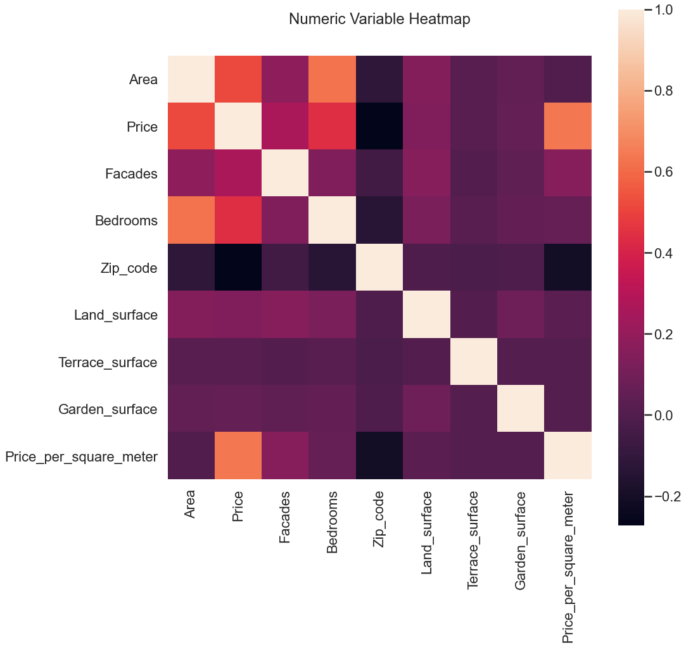
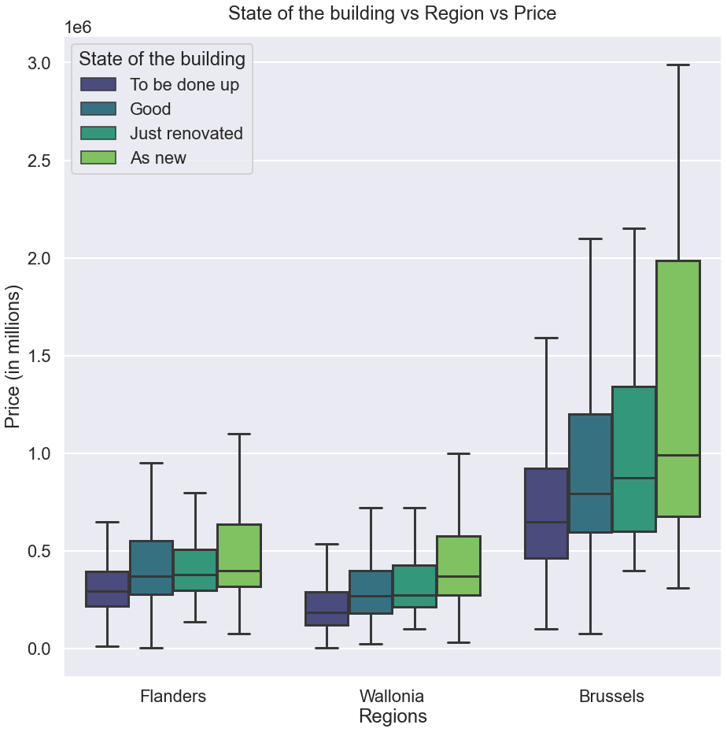

# Description
This is a job we received from the real estate company "ImmoEliza".   
The goal was to gather as much knowledge of the real estate market in Belgium.   
For this we were handed a database on all the houses for sale, on 16/06/2021.   
In this repository you will find all the data we collected and all the code we used,     along with our findings.   

# Installation

## Python version
* Python 3.9

## Packages used
* pandas
* numpy
* matplotlib.pyplot
* seaborn
* plotly.express
* scipy

# Usage
+--------------------------------------+-----------------------------------------------------------+
| Filename                             | Usage                                                     |
+======================================+===========================================================+
| Immo_Elisa_house_data_analysis.ipynb | Jupyer Notebook file containing Python code.              |
|                                      |                                                           |
|                                      | Used to clean the data.                                   |
|                                      |                                                           |
|                                      | Used to draw plots and do preliminary analysis.           |
+--------------------------------------+-----------------------------------------------------------+
| house_data_ultimate_cleaned.csv      | File containing data of houses for sale, in Belgium.      |
|                                      |                                                           |
|                                      | Contains price, area, building state, etc...              |
+--------------------------------------+-----------------------------------------------------------+
| Belgium_zip_municipalities.txt       | File containing data on Belgium.                          |
|                                      |                                                           |
|                                      | Contains zip-codes, city names, longitude and langitudes. |
+--------------------------------------+-----------------------------------------------------------+

# Visuals
## Map of Belgium
Each dot represents a municipality of Belgium.  
The size and color depends on the price per square meter of that area.  

## Heatmap showing correlation between data

## Plot showing correlation between regions

# Contributors
+----------------+------------------------------------+
| Name           | GitHub                             |
+================+====================================+
| Jayesh Italiya | https://github.com/lvendrix        |
+----------------+------------------------------------+
| Logan Vendrix  | https://github.com/JayeshItaliya86 |
+----------------+------------------------------------+
| Matthew Samyn  | https://github.com/matthew-samyn   |
+----------------+------------------------------------+

# Timeline
28/06/2021 - 30/06/2021